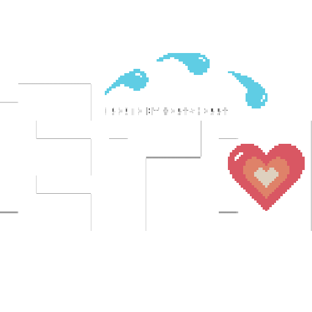

uEmuera
=======

[English](#english) | [中文](#中文)

---

## English

**Special Note for Android 10:**
**If the app cannot find files placed in sdcard/uEmuera, try placing them in sdcard/Android/data/xerysherry.uEmuera/files/ instead.**

Emuera stands for "Emulator of Eramaker", a text-based game platform for Windows.

This project is a Unity3D port of Emuera. It leverages Unity3D's cross-platform capabilities to make it easier to port to non-Windows platforms.

The current project is based on the emuera1824v15 source code. Some GXX-related drawing instructions have not been implemented.

It can run almost all era script games!

### Download
----

[https://github.com/xerysherry/uEmuera/releases](https://github.com/xerysherry/uEmuera/releases)

### How to Use
--------

1. Ensure that all era-related files are encoded in UTF-8, including \*.csv, \*.ERB, and \*.ERH files.

2. When running the app for the first time, grant "File Access" permission.

3. Place the processed era script folder in the emuera folder on your sdcard. Full paths: storage/emulated/0/emuera, storage/emulated/1/emuera, storage/emulated/2/emuera

### Known Issues / Areas for Improvement
-------------------

1. Cannot modify era game configuration within the app

2. No debugging functionality

3. Some game instructions have low efficiency, causing lag

4. May consume more battery (a common issue with Unity3D applications)

5. ...

### Screenshots
----

Start Screen

Game Running Screen

Quick Buttons

Command Input

Zoom Control

---

## 中文

**Android10 特别说明：**
**如果放入sdcard/uEmuera下无法找到的话，可以放入sdcard/Android/data/xerysherry.uEmuera/files/下**

Emuera是Emulator of Eramaker的缩写，是Windows平台下文字游戏平台。

该项目为Emuera的Unity3D移植版本。意在利用Unity3D多平台特性，方便移植到非Windows平台。

当前项目以基于emuera1824v15版本源代码，部分GXX相关绘制指令没有实现。

几乎可以执行所有era脚本游戏！

### 下载
----

[https://github.com/xerysherry/uEmuera/releases](https://github.com/xerysherry/uEmuera/releases)

### 如何使用：
--------

1. 请确保era相关文件编码为UTF8，包括\*.csv, \*.ERB, \*.ERH。

2. 请在初次运行app时，选择允许"文件访问"的权限。

3. 请把处理完毕的era脚本文件夹放置在sdcard下的emuera文件夹内。完整路径为storage/emulated/0/emuera, storage/emulated/1/emuera, storage/emulated/2/emuera

### 已知问题/需要改进项：
-------------------

1. 无法在app内修改era游戏配置

2. 无调试功能

3. 部分游戏的某些指令效率较低，导致卡顿

4. 可能会比较耗电（Unity3D程序通病）

5. ...

### 截图
----

开始界面

游戏运行界面

快捷按钮

指令输入

缩放控制

