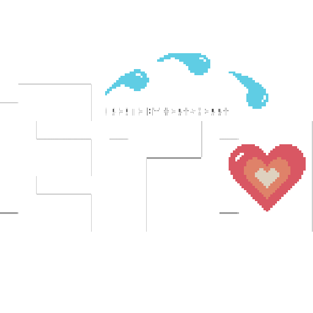

# uEmuera — Noa Version

**A cross-platform Emuera emulator powered by Unity 6**

Run era script games on **Windows**, **Linux**, and **Android**!

[**Download**](https://github.com/Noa3/uEmuera/releases) · [**Wiki**](https://github.com/Noa3/uEmuera/wiki/) · [**Issues**](https://github.com/Noa3/uEmuera/issues)

---

[English](#about) | [中文](#中文) | [Deutsch](#deutsch)

## About

Emuera ("Emulator of Eramaker") is a text-based game platform originally built for Windows. **uEmuera** is a Unity 6 port that runs era script games on Windows, Linux, and Android.

This fork is based on [xerysherry/uEmuera](https://github.com/xerysherry/uEmuera) (emuera1824v15) with extensive improvements, modernizations, and EM/EE (Emuera MultipleEx/Emuera EnhanceEx) extension support.

> **Android 10+ Note:** If the app cannot find files in `sdcard/uEmuera`, place them in `sdcard/Android/data/noa3.uEmuera/files/` instead.

## ✨ Features

<table>
<tr><td>

### Engine & Performance
- **Unity 6** (6000.3.3f1) — upgraded from Unity 2018/2019
- **IL2CPP** scripting backend for all platforms
- **Burst compiler** & SIMD-optimized math (5-6x faster)
- **Incremental GC** — reduced frame hitches
- **Graphics Jobs** enabled on all platforms
- **75% reduction** in GC allocations during scrolling
- Modern C# 9.0 features

</td><td>

### Game Compatibility
- **EM/EE Extensions**: `BINPUT`, `BINPUTS`, `TRYCALLF`, `TRYCALLFORMF`
- **Audio**: `PLAYSOUND`/`STOPSOUND`, `PLAYBGM`/`STOPBGM`, `EXISTSOUND` (WAV)
- **GXX Graphics** instruction support
- **Case-insensitive** folder name detection
- Runs **almost all** era script games

</td></tr>
<tr><td>

### UI/UX
- **Dark theme** — reduced eye strain with ERA game aesthetics
- **Pixel Perfect** rendering — crisp text and images
- **CRT post-processing** — optional retro CRT effect
- **Resizable window** — flexible windowed mode on desktop
- **Gothic font** support

</td><td>

### Development
- **Unit tests** — EditMode & PlayMode test suites
- **Multi-language** UI — English, Chinese, Japanese
- **XML documentation** on all public APIs
- **Translated comments** — JP/CN → English
- [Performance Docs](Docs/PERFORMANCE_OPTIMIZATIONS.md)

</td></tr>
</table>

## 📥 Download

**[→ Latest Release](https://github.com/Noa3/uEmuera/releases)**

| Platform | Build | Notes |
|----------|-------|-------|
| **Windows** | `.zip` | Extract and run. Resizable window, starts windowed. |
| **Linux** | `.zip` | Extract, `chmod +x`, run. Resizable window. |
| **Android** | `.apk` | Sideload. Grant file access on first launch. |

## 🚀 Quick Start

1. **Ensure UTF-8 encoding** for all era files (`*.csv`, `*.ERB`, `*.ERH`)
2. **Grant file access** permission on first launch
3. **Place era game folders** in the appropriate location:

| Platform | Game Folder Path |
|----------|-----------------|
| **Windows / Linux** | Same directory as the executable, or select via file browser |
| **Android** | `storage/emulated/0/emuera` or `Android/data/noa3.uEmuera/files/` |

## 🖼️ Screenshots

Click to expand screenshots

**Game: EraMakakaiRanch**

**Game: EraAkumaMaid**

| Start Screen | Game Running | Quick Buttons |
|:---:|:---:|:---:|
|  |  |  |

| Command Input | Zoom Control |
|:---:|:---:|
|  |  |

## ⚙️ Build Optimizations

This fork applies aggressive build optimizations for all platforms:

| Setting | Android | Windows / Linux |
|---------|---------|-----------------|
| Scripting Backend | IL2CPP | IL2CPP |
| Managed Stripping | High | High |
| Engine Code Stripping | ✅ | ✅ |
| Incremental GC | ✅ | ✅ |
| Graphics Jobs | ✅ | ✅ |
| Burst Compiler | ✅ | ✅ |
| Mip Stripping | ✅ | ✅ |
| Multithreaded Rendering | ✅ | ✅ |

## 🐛 Known Issues

- Cannot modify era game configuration within the app
- No debugging functionality
- Some game instructions have low efficiency, causing lag
- Higher battery consumption (common with Unity3D apps)
- OGG/MP3 audio requires async loading — **WAV recommended** for synchronous playback

## 💖 Support This Project

If you find uEmuera useful, consider supporting development:

<!-- TODO: Replace YOUR_PAYPAL_USERNAME with your actual PayPal username -->

You can also support via GitHub Sponsors using the **Sponsor** button at the top of this repository.

## 📄 License

Licensed under the [Apache License 2.0](LICENSE).

Based on [xerysherry/uEmuera](https://github.com/xerysherry/uEmuera) and emuera1824v15.

---

## 中文

**uEmuera** 是 Emuera（Emulator of Eramaker）的 Unity 6 移植版，可在 **Windows**、**Linux** 和 **Android** 上运行 era 脚本游戏。

基于 [xerysherry/uEmuera](https://github.com/xerysherry/uEmuera)（emuera1824v15），包含大量改进和 EM/EE 扩展支持。

> **Android 10+ 说明：** 如果 `sdcard/uEmuera` 无法找到文件，请放入 `sdcard/Android/data/noa3.uEmuera/files/`

### 主要特性

- **Unity 6** 引擎，IL2CPP 编译，Burst 优化
- **EM/EE 扩展命令**：`BINPUT`、`TRYCALLF` 等
- **完整音频系统**：`PLAYSOUND`、`PLAYBGM` 等（支持 WAV）
- **GXX 图形指令**支持
- **深色主题 UI**、**像素完美渲染**、**CRT 后处理效果**
- **可调整窗口大小** — 桌面端灵活窗口模式
- 多语言支持（英文、中文、日文）

### 快速开始

1. 确保所有 era 文件编码为 **UTF-8**（`*.csv`、`*.ERB`、`*.ERH`）
2. 首次运行时授予 **文件访问** 权限
3. 将 era 游戏文件夹放在：
   - **Android**: `storage/emulated/0/emuera` 或 `Android/data/noa3.uEmuera/files/`
   - **Windows/Linux**: 程序目录内，或通过文件浏览器选择

### 已知问题

- 无法在 app 内修改游戏配置
- 无调试功能
- 部分指令效率较低可能导致卡顿
- OGG/MP3 需异步加载，建议使用 **WAV** 格式

### 下载

**[→ 最新版本](https://github.com/Noa3/uEmuera/releases)**

---

## Deutsch

**uEmuera** ist eine Unity 6-Portierung von Emuera (Emulator of Eramaker) für **Windows**, **Linux** und **Android**.

Basierend auf [xerysherry/uEmuera](https://github.com/xerysherry/uEmuera) (emuera1824v15) mit umfangreichen Verbesserungen und EM/EE-Erweiterungen.

> **Android 10+ Hinweis:** Wenn `sdcard/uEmuera` nicht funktioniert, Dateien in `sdcard/Android/data/noa3.uEmuera/files/` ablegen.

### Hauptmerkmale

- **Unity 6** Engine, IL2CPP-Kompilierung, Burst-Optimierung
- **EM/EE-Erweiterungen**: `BINPUT`, `TRYCALLF` usw.
- **Vollständiges Audiosystem**: `PLAYSOUND`, `PLAYBGM` usw. (WAV-Format)
- **GXX-Grafikbefehle**
- **Dunkles Theme**, **Pixel Perfect Rendering**, **CRT-Effekt**
- **Anpassbare Fenstergröße** — flexibler Fenstermodus auf dem Desktop
- Mehrsprachig (Englisch, Chinesisch, Japanisch)

### Schnellstart

1. Alle Era-Dateien müssen **UTF-8**-kodiert sein (`*.csv`, `*.ERB`, `*.ERH`)
2. Beim ersten Start **Dateizugriff** erlauben
3. Era-Spielordner ablegen in:
   - **Android**: `storage/emulated/0/emuera` oder `Android/data/noa3.uEmuera/files/`
   - **Windows/Linux**: Im Programmverzeichnis oder über den Dateibrowser auswählen

### Bekannte Probleme

- Spielkonfiguration kann nicht in der App geändert werden
- Keine Debugging-Funktionalität
- Einige Befehle können Verzögerungen verursachen
- OGG/MP3 erfordern asynchrones Laden — **WAV empfohlen**

### Download

**[→ Neueste Version](https://github.com/Noa3/uEmuera/releases)**
